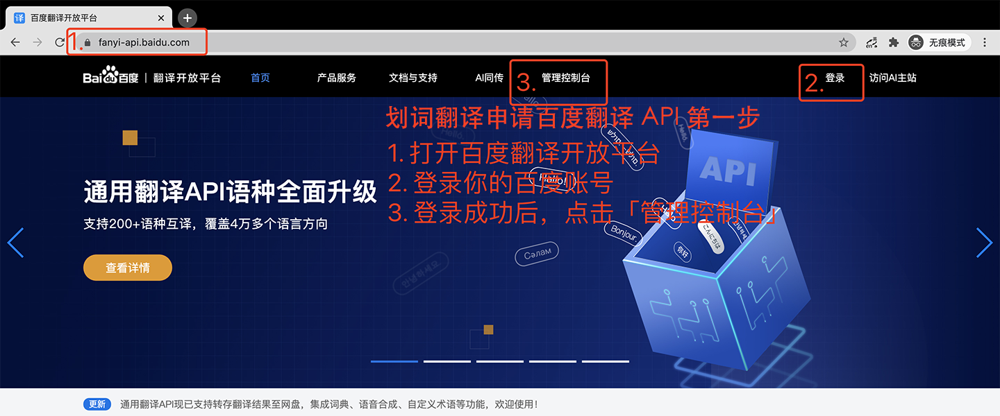
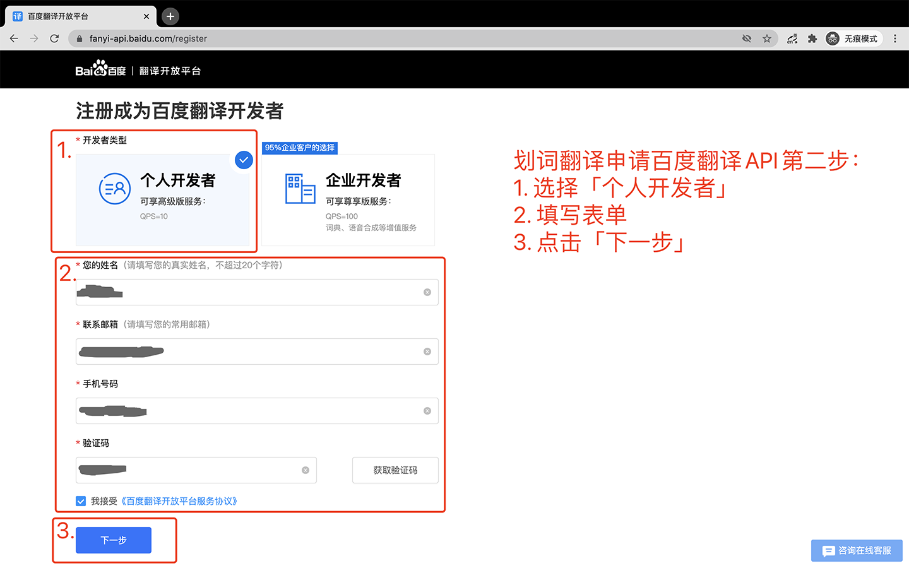

<global-header />

# 申请百度翻译 API ID 的图文步骤

申请百度翻译 API 只需要四步，并且百度翻译官方接口是免费使用的，详细介绍见[官方接口介绍](use-official-api.html)。

## 第一步：登录百度翻译开放平台

打开百度翻译开放平台 [https://fanyi-api.baidu.com/](https://fanyi-api.baidu.com/) 并登录你的百度账号，登录成功后点击「管理控制台」。

## 第二步：注册成为百度翻译开发者

第一次进入管理控制台会让你注册成为百度翻译开发者，如下图。选择「个人开发者」并填写表单后点击「下一步」。**注册成功后会让你进行身份认证，点击「取消」就行。**

## 第三步：开通「通用翻译服务」

注册成功后，打开控制台 [https://fanyi-api.baidu.com/api/trans/product/desktop](https://fanyi-api.baidu.com/api/trans/product/desktop)，点击「立即开通」按钮，然后：

1. 选择「通用翻译（适用于文本翻译）」并点击「下一步」
2. 选择「开通标准版」
3. 填写应用名称"划词翻译"然后点击「提交申请」，会提示「开通成功」

## 第四步：在划词翻译中填写百度翻译 APP ID 和密钥

打开百度翻译开放平台控制台 [https://fanyi-api.baidu.com/api/trans/product/desktop](https://fanyi-api.baidu.com/api/trans/product/desktop)，将页面最底部「申请信息」中的「APP ID」和「密钥」填写进划词翻译。

注意：划词翻译目前的最新版本为 <LatestVersion />。从 v7.5.0 开始才可以将百度翻译 APP ID 和密钥填写进划词翻译，届时会更新此处的文档。